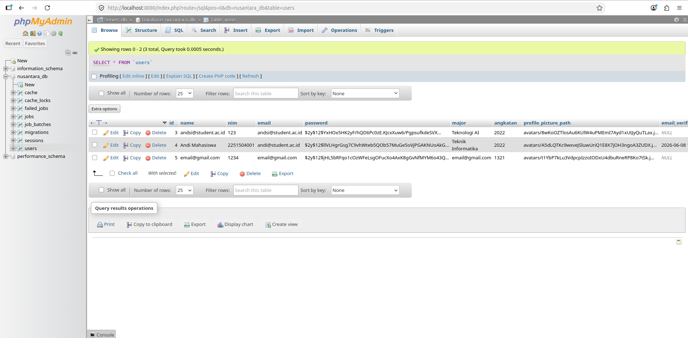
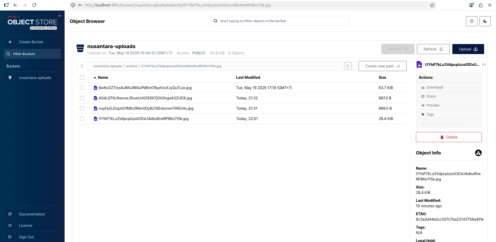
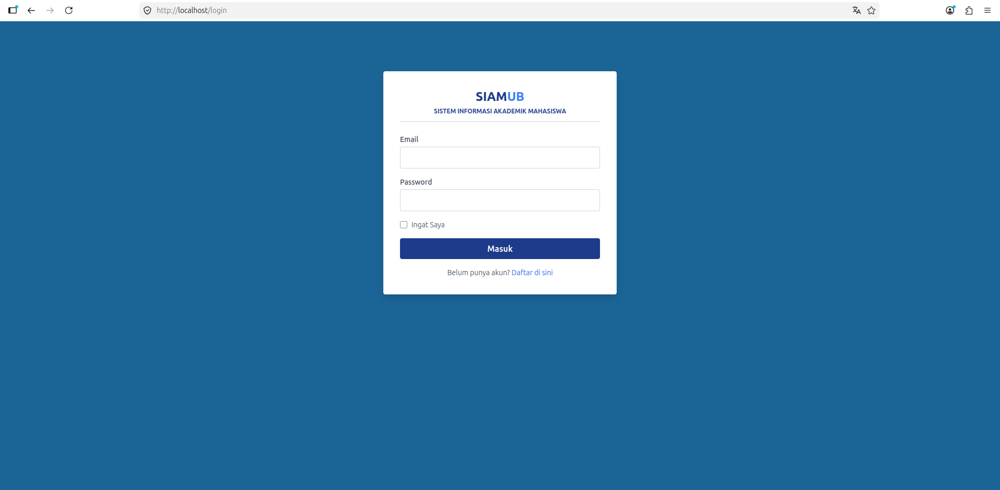
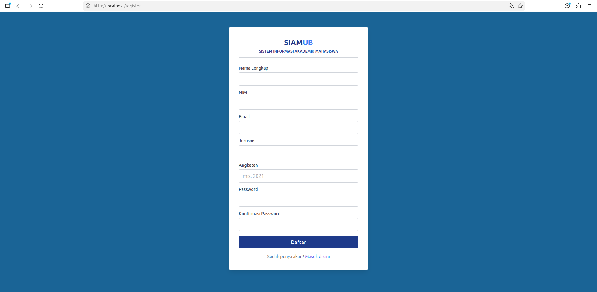
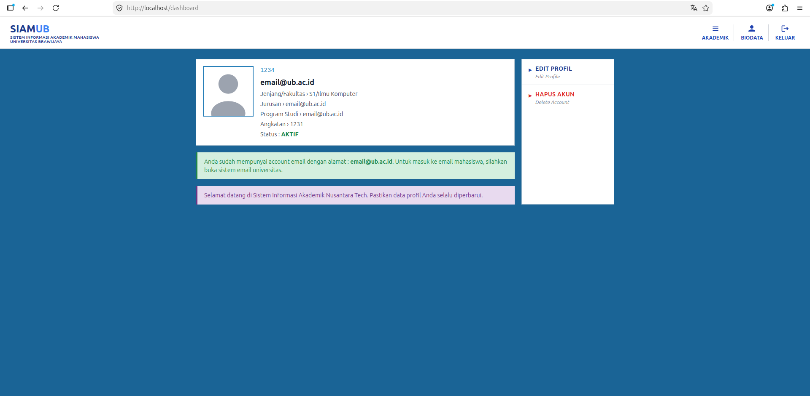
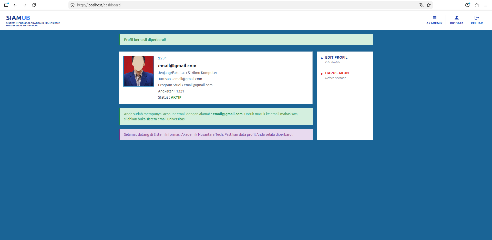
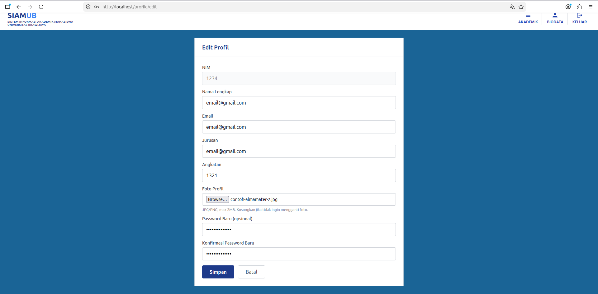

> **Tugas ASIS TI-D** — 
>
> Nurul Inayah - 245150700111013 
> Ezekiel Aaron Marmora - 245150701111017
> Oase Bimasena I - 245150707111059
> 

---

## 1. Tech Stack

| Service    | Technology            | Version       |
|------------|-----------------------|---------------|
| App        | PHP + Laravel         | 8.2 / 11.x    |
| Web Server | Nginx (reverse proxy) | 1.25-alpine   |
| Database   | MySQL                 | 8.0           |
| Storage    | MinIO (S3-compatible) | latest        |
| DB GUI     | phpMyAdmin            | latest        |
| Frontend   | Blade + Tailwind CSS CDN + Alpine.js | —  |

---

## 2. Prerequisites

| Software         | Minimum Version |
|------------------|-----------------|
| Docker Engine    | 20.10+          |
| Docker Compose   | 2.0+            |
| Git              | any             |

Verify installation:
```bash
docker --version
docker compose version
```

---

## 3. Installation

```bash
git clone <repo-url> nusantara-tech
cd nusantara-tech

cp .env.example .env

# Start 5 images
docker compose up -d --build

# Generate key
docker compose exec app php artisan key:generate

# Migrate database
docker compose exec app php artisan migrate

# Configure MinIO
docker compose exec minio mc alias set local http://localhost:9000 minioadmin minioadmin123
docker compose exec minio mc mb local/nusantara-uploads
docker compose exec minio mc anonymous set public local/nusantara-uploads

docker compose exec app php artisan db:seed

```
### DEMO ACCOUNT: `andi@student.ac.id` / `password123`

## 4. Access Points

| Service         | URL                          | Default Credentials       | Notes                        |
|-----------------|------------------------------|---------------------------|------------------------------|
| **Web App**     | http://localhost             | Register to create account | Login page → Dashboard       |
| **MinIO Console** | http://localhost:9001      | `minioadmin` / `minioadmin123` | S3-compatible object storage UI |
| **phpMyAdmin**  | http://localhost:8080        | `nusantara_user` / `nusantara_pass` | MySQL database management |

> All credentials above are the **placeholder defaults** from `.env.example`.
> Change them in `.env` before deploying anywhere other than localhost.

---

## 5. Progres 1 — Laporan Minggu Pertama

### A. Pemilihan Tech-Stack

* Bahasa pemrograman atau *framework* apa yang Anda pilih untuk aplikasi CRUD Anda (misal: Node.js, Python/Flask, PHP)? Apa *base image* yang Anda gunakan dalam Dockerfile?  
  \- Untuk Bahasa pemrogaman yang kami gunakan adalah PHP dengan framework Laravel dan base image yang kami gunakan adalah `php:8.2-fpm-alpine`
* Database apa yang Anda gunakan (MySQL/PostgreSQL)? Mengapa memilih versi tersebut?  
  \- Database yang kami gunakan adalah MySQL versi 8.0 karena versi ini menawarkan fleksibilitas pengembangan modern sekaligus efisiensi tinggi saat dijalankan dalam ekosistem kontainer. Dukungan tipe data JSON yang jauh lebih optimal pada MySQL 8.0 memberikan fleksibilitas bagi aplikasi CRUD untuk menyimpan data mahasiswa yang bersifat dinamis tanpa harus sering merombak skema tabel utama. Selain itu, untuk memenuhi ketentuan tambahan dimana kita perlu menggunakan GUI untuk Database yaitu phpMyAdmin, maka kita perlu menggunakan database yang memang ditujukan untuk phpMyAdmin, maka digunakanlah MySQL.
* Konfirmasikan bahwa Anda sudah menggunakan MinIO. Apa nama *bucket* yang rencananya akan Anda gunakan untuk menyimpan dokumen/foto mahasiswa?  
  \- Ya, kami sudah menggunakan MinIO dibuktikan dengan berjalannya *service* MinIO pada Docker Compose dan untuk nama bucket yang akan kami gunakan adalah `nusantara-uploads`.

### B. Desain Arsitektur Jaringan

Dalam arsitektur *container*, komunikasi antar-layanan adalah hal krusial. Mohon jelaskan:

* Apa nama *docker network* yang Anda definisikan dalam docker-compose.yml?  
  \- Nama docker network yang kami definisikan pada file docker-compose.yml adalah `nusantara_network` dengan driver bridge. Network ini digunakan sebagai jaringan internal Docker agar seluruh service seperti aplikasi Laravel, Nginx, MySQL, phpMyAdmin, dan MinIO dapat saling terhubung dan berkomunikasi dalam satu ekosistem container tanpa perlu menggunakan IP address secara manual.
* Bagaimana cara aplikasi web Anda memanggil Database dan MinIO? Jelaskan bagaimana Anda memanfaatkan *Service Name* Docker  
  \- Aplikasi web kami memanggil Database dan MinIO dengan memanfaatkan Service Name Docker Compose sebagai hostname internal antar-container. Untuk koneksi database, aplikasi menggunakan hostname `db` dengan port 3306, yang dikonfigurasi melalui environment variable `DB_HOST=db`. Sedangkan untuk layanan object storage MinIO, aplikasi menggunakan endpoint `http://minio:9000` yang berasal dari nama service `minio`. Dengan mekanisme ini, Docker secara otomatis menyediakan DNS internal sehingga setiap container dapat saling mengenali hanya melalui nama servicenya tanpa perlu konfigurasi IP address manual.
* Berapa nomor port *host* yang Anda buka untuk mengakses:
  * Dashboard Utama Aplikasi? **Port 80**
  * Dashboard GUI Database (jika ada)? **Port 8080**
  * Console MinIO? **Port 9001**

### C. Kendala Teknis

* Apa kendala terbesar yang dihadapi dalam menghubungkan antar *container* di minggu pertama ini?  
  \- Kendala terbesar ada dalam melakukan manajemen akses menggunakan MinIO. Dalam proyek ini, kami menciptakan fitur dimana pengguna dapat melakukan upload avatar dalam Sistem Informasi Akademik. Walaupun penyetoran berhasil dan berjalan dengan baik, saat foto tersebut perlu ditunjukkan dalam aplikasi web, malah tidak tertunjuk. Ini ada hal dengan memastikan bahwa link yang digunakan untuk menunjukkan avatar pada dashboard pengguna merupakan link internal yang tidak bisa diakses oleh browser. Oleh karena itu, perlu ada pergantian link dari link jaringan internal Docker menjadi link localhost yang dapat diakses oleh pengguna.
* Apakah ada layanan yang sering *exit* atau *error* saat dijalankan dengan docker-compose up?  
  \- Tidak ada

---

## 6. User Journey

| Step | Action | Description |
|------|--------|-------------|
| 1 | **Register** | Visit http://localhost, click "Daftar di sini", fill in Nama, NIM, Email, Jurusan, Angkatan, Password |
| 2 | **Login** | Enter Email and Password, click "Masuk" |
| 3 | **Dashboard** | View full student profile — NIM, name, major, angkatan, status AKTIF |
| 4 | **Edit Profile** | Click "EDIT PROFIL" in sidebar → update name, email, major, angkatan, or upload photo (JPG/PNG, max 2MB) |
| 5 | **Delete Account** | Click "HAPUS AKUN" in sidebar → confirm in modal dialog → account, photo, and data permanently deleted |

---

## 7. MinIO Object Storage

### Bucket Configuration

| Setting    | Value                |
|------------|----------------------|
| Bucket name | `nusantara-uploads` |
| Photo prefix | `avatars/`         |
| Access     | Public (anonymous read) |
| API endpoint | `http://minio:9000` (internal Docker network) |
| Public URL | `http://localhost:9000/nusantara-uploads/avatars/<filename>` |


### Manual check

```bash
# List files in bucket
docker compose exec minio mc ls local/nusantara-uploads/avatars/

# Check bucket size
docker compose exec minio mc du local/nusantara-uploads

# Make bucket public (if needed)
docker compose exec minio mc anonymous set public local/nusantara-uploads
```


## 8. Stopping & Tearing Down

```bash
# Stop all containers (data preserved)
docker compose down

# Stop all containers AND delete volumes (fresh start)
docker compose down -v

# Stop without removing containers
docker compose stop

# Restart all services
docker compose restart

# View logs
docker compose logs -f

# View logs for a specific service
docker compose logs -f app
docker compose logs -f db
```

---

## 9. Screenshots

### 9.1 App ↔ Database (MySQL)



### 9.2 App ↔ MinIO Object Storage



### 9.3 Web Application Pages











---

## 11. Docker Architecture

```
┌─────────────────────────────────────────────────────────┐
│                  nusantara_network (bridge)              │
│                                                         │
│  ┌──────────────┐   ┌──────────────┐   ┌────────────┐  │
│  │    nginx     │   │     app      │   │     db     │  │
│  │   :80→host   │──→│   :9000      │──→│   :3306    │  │
│  │  nginx:1.25  │   │  php:8.2-fpm │   │  mysql:8.0 │  │
│  └──────────────┘   └──────┬───────┘   └─────┬──────┘  │
│                            │                 │         │
│                            │            ┌────┴───────┐  │
│                            │            │ phpmyadmin │  │
│                            │            │  :8080→host│  │
│                            │            └────────────┘  │
│                            │                            │
│                     ┌──────┴───────┐                    │
│                     │    minio     │                    │
│                     │ :9000→host   │                    │
│                     │ :9001→host   │                    │
│                     └──────────────┘                    │
│                                                         │
│  Volumes: db_data → /var/lib/mysql                      │
│           minio_data → /data                            │
└─────────────────────────────────────────────────────────┘
```

### Inter-Service Communication

| From   | To       | Address           | Protocol  |
|--------|----------|-------------------|-----------|
| nginx  | app      | `app:9000`        | FastCGI   |
| app    | db       | `db:3306`         | MySQL TCP |
| app    | minio    | `http://minio:9000` | S3 API  |
| phpmyadmin | db   | `db:3306`         | MySQL TCP |

All communication uses **Docker service names** on the `nusantara_network` bridge.
No `localhost` is used for inter-container communication.

---
